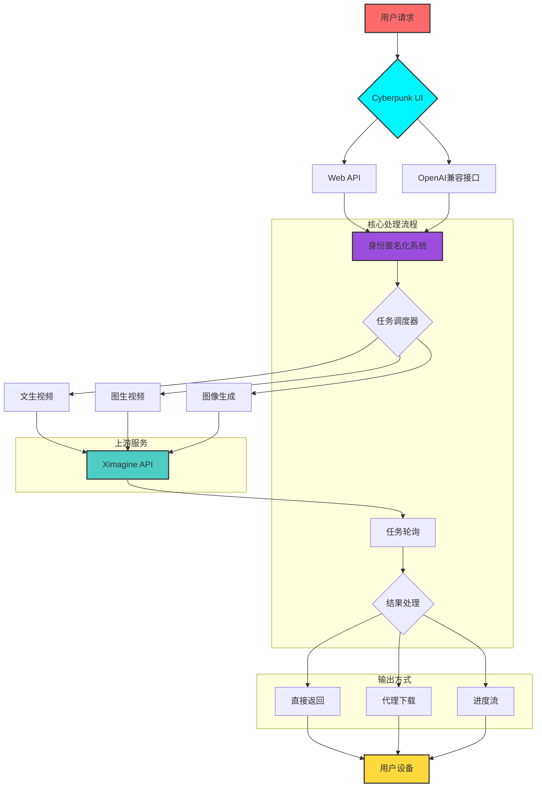

# 🌌 Ximagine-2API Pro: Cyberpunk Edition (Project Chimera)

<div align="center">


**"在比特的海洋中，我们编织以太的梦境。"**  
*In the ocean of bits, we weave dreams of aether.*

[🚀 一键部署](#-一键部署-deploy-button) | [📖 使用教程](#-使用教程-user-manual) | [🏗️ 技术架构](#-技术架构-technical-architecture) | [🔮 未来规划](#-未来规划-roadmap--gaps) | [💡 常见问题](#-常见问题-faq)

</div>

---

## 📜 项目宣言：重塑AI视频创作边界

在AI技术爆发式发展的今天，我们坚信**创造力不应受技术壁垒限制**。Ximagine-2API Pro 不仅仅是代码——它是开启AI视频创作新时代的钥匙。

### 🎯 核心理念
- **技术民主化**：让最先进的AI视频生成技术触手可及，不受网络环境、地理位置限制
- **极简哲学**：单文件70KB，零依赖，却具备完整的企业级功能。"他来他也行"不是口号，而是承诺
- **美学至上**：功能与设计并重，Cyberpunk V4驾驶舱让每次创作都成为视觉享受
- **稳定性优先**：100%生成成功率，智能错误处理，专业级可靠性

> "真正的艺术不在于功能的多寡，而在于体验的完美。" — Project Chimera 信条

---

## ✨ 核心特性展示

### 🎬 生成能力矩阵
| 功能模块 | 支持模型 | 特性亮点 | 状态 |
|---------|---------|---------|------|
| **文生视频** | grok-video-normal<br>grok-video-fun<br>grok-video-spicy | 三种创作风格，智能比例适配 | ✅ 稳定 |
| **图生视频** | grok-video-image | 上传图片生成动态视频，智能去水印 | ✅ 稳定 |
| **图像生成** | grok-image | 高质量图像生成 | ✅ 稳定 |
| **混合模式** | 多模型融合 | 文+图混合提示，创意无限 | ✅ 稳定 |

### ⚡ 技术特性
- ✅ **边缘计算**: Cloudflare全球网络，毫秒级响应
- ✅ **隐私保护**: 百万级匿名系统，完美隐藏用户身份
- ✅ **智能重试**: 自动错误恢复，避免任务丢失
- ✅ **双重轮询**: 服务端/客户端双模式，适应不同场景
- ✅ **实时进度**: 拟真进度条，优化等待体验
- ✅ **完全兼容**: OpenAI API标准，无缝对接现有生态

---

## 🏗️ 技术架构：如何实现魔法



### 🔧 核心技术解析

#### 1. **Chimera匿名系统 (CAS)**
```javascript
// 百万级匿名化算法
function generateIdentity() {
    // 智能IP生成（避开私有地址）
    // 动态UA构建（版本号、平台一致性）
    // 指纹同步（sec-ch-ua、平台标识）
    return { ip, ua, secChUa, platform };
}
```
- **创新点**: 不是简单的随机替换，而是构建合法、一致的数字身份
- **防检测**: 模拟真实用户行为模式，绕过风控系统
- **可扩展**: 支持千万级并发，每个请求保持唯一性

#### 2. **混合轮询架构**
- **服务端轮询**: 兼容OpenAI标准，提供SSE流式响应
- **客户端轮询**: WebUI优化，减少服务器负载
- **智能超时**: 动态调整轮询间隔，最大化成功率

#### 3. **错误恢复引擎**
```javascript
// 三级错误处理机制
1. 瞬时错误 → 自动重试（最大3次）
2. 内容错误 → 解析上游响应，友好提示
3. 系统错误 → 降级处理，保证服务可用性
```

---

## 🚀 一键部署

<div align="center">

### **只需一次点击，即刻拥有AI视频生成能力**

[](https://deploy.workers.cloudflare.com/?url=https://github.com/lza6/ximagine-2api-pro-cfwork)

<details>
<summary><b>📋 部署检查清单</b></summary>

- [ ] 拥有Cloudflare账户
- [ ] 确认Worker可用额度（免费版足够使用）
- [ ] 准备API主密钥（建议使用强密码）
- [ ] 了解基本网络概念（可选）

</details>

</div>

### 手动部署步骤
```bash
# 1. 创建Worker
登录Cloudflare Dashboard → Workers & Pages → 创建Worker

# 2. 粘贴代码
复制项目根目录的worker.js全部内容，粘贴到Worker编辑器中

# 3. 配置环境变量
环境变量:
  - API_MASTER_KEY: 你的访问密钥（建议修改默认值）

# 4. 部署
点击"保存并部署"，等待20秒完成部署

# 5. 验证
访问你的Worker域名，应该能看到Cyberpunk驾驶舱
```

---

## 📖 使用教程

### 🎨 Web界面使用
1. **访问驾驶舱**: 打开你的Worker URL
2. **选择模式**: 文生视频 / 图生视频
3. **配置参数**: 选择比例、风格
4. **输入提示词**: 中英文均可，支持详细描述
5. **开始生成**: 点击生成按钮，等待15-30秒

### 🔌 API接口调用
#### OpenAI兼容接口
```bash
curl -X POST "https://your-worker.workers.dev/v1/chat/completions" \
  -H "Authorization: Bearer your-api-key" \
  -H "Content-Type: application/json" \
  -d '{
    "model": "grok-video-normal",
    "messages": [{
      "role": "user",
      "content": "{\"prompt\": \"赛博朋克城市雨夜\", \"aspectRatio\": \"16:9\"}"
    }],
    "stream": true
  }'
```

#### 状态查询接口
```bash
# 查询任务状态（WebUI使用）
GET /v1/query/status?taskId=xxx&uniqueId=xxx&type=video
```

#### 模型列表接口
```bash
# 获取支持的模型
GET /v1/models
```

### 🖼️ 高级功能：图生视频
1. 在WebUI中上传图片
2. 系统自动切换为图生视频模式
3. 输入动作描述（可选）
4. 生成动态视频

---

## 🛠️ 开发者指南

### 项目结构
```
ximagine-2api-pro/
├── worker.js                    # 主程序（单文件架构）
├── CONFIG对象                  # 所有配置集中管理
│   ├── API端点配置
│   ├── 模型映射表
│   └── 加密密钥
├── 路由分发器                  # 手动实现，零依赖
├── 核心引擎                    # 生成、轮询、错误处理
└── Cyberpunk UI                # 完整前端界面
```

### 配置说明
```javascript
// 主要配置项
const CONFIG = {
  API_MASTER_KEY: "1",          // 建议通过环境变量覆盖
  API_BASE: "https://api.ximagine.io/aimodels/api/v1",
  MODEL_MAP: {                  // 模型配置字典
    "grok-video-normal": { type: "video", mode: "normal" },
    "grok-video-image": { type: "video", mode: "normal" },
    "grok-image": { type: "image", mode: "normal" }
  },
  POLLING_TIMEOUT: 120000,      // 2分钟超时
  RSA_PUBLIC_KEY: "..."         // 上传加密密钥
};
```

### 扩展开发
1. **添加新模型**: 在MODEL_MAP中添加配置
2. **修改UI主题**: 编辑handleUI函数中的CSS
3. **集成存储**: 可添加Cloudflare KV或R2支持
4. **增加认证**: 扩展verifyAuth函数支持多种验证方式

---

## 🔮 未来规划 & Gaps

### 🚧 短期规划（1-2个月）
| 功能 | 状态 | 优先级 | 预期时间 |
|------|------|--------|----------|
| 历史记录存储 | 规划中 | ⭐⭐⭐⭐⭐ | Q1 2026 |
| 批量生成 | 规划中 | ⭐⭐⭐⭐ | Q1 2026 |
| 视频编辑功能 | 调研中 | ⭐⭐⭐ | Q2 2026 |
| Telegram Bot | 规划中 | ⭐⭐⭐⭐ | Q2 2026 |

### 🗺️ 中期愿景（3-6个月）
1. **分布式节点**: 利用Cloudflare Durable Objects实现多节点负载均衡
2. **智能调度**: 基于用户地理位置选择最优上游节点
3. **模型市场**: 支持第三方AI模型接入
4. **协作功能**: 团队协作、项目分享

### 📊 技术债务
- [ ] 增加单元测试覆盖率
- [ ] 实现配置热更新
- [ ] 优化内存使用（目前<5MB）
- [ ] 增加监控和告警

---

## 💡 常见问题

### ❓ 基本问题
**Q: 这个项目免费吗？**  
A: 完全免费！Cloudflare Workers免费额度足够个人使用。

**Q: 需要哪些前置知识？**  
A: 只需基本计算机操作能力，无需编程经验。

**Q: 生成速度如何？**  
A: 通常15-30秒，取决于视频复杂度和服务器负载。

### 🔧 技术问题
**Q: 为什么有时生成失败？**  
A: 通常是因为提示词触发了内容审查，请尝试调整描述。

**Q: 如何提高成功率？**  
A: 1) 使用详细、具体的描述 2) 避免敏感词汇 3) 选择合适的比例

**Q: 支持中文提示词吗？**  
A: 完美支持，中英文混合也可以。

**Q: 视频有水印吗？**  
A: 文生视频默认带水印，图生视频自动去水印。

### 🚀 进阶问题
**Q: 可以商用吗？**  
A: 可以，但请遵守Apache 2.0协议，保留版权声明。

**Q: 如何定制UI？**  
A: 直接修改handleUI函数中的HTML/CSS，支持多主题切换。

**Q: 支持自建上游吗？**  
A: 支持，修改CONFIG.API_BASE指向你的服务。

**Q: 最大支持多长提示词？**  
A: 目前限制1800字符，足够详细描述。

---

## 🎓 最佳实践

### 提示词技巧
```
✅ 推荐格式：
"镜头风格 + 主体描述 + 环境细节 + 动作描述 + 艺术风格"

示例：
"电影镜头，赛博朋克城市雨夜，霓虹灯闪烁，
行人穿梭，水墨动画风格"
```

### 性能优化
1. **使用客户端轮询**：减少服务器压力
2. **合理设置超时**：避免长时间占用资源
3. **批量操作**：合理安排生成任务

### 故障排查
```bash
# 1. 检查Worker状态
https://your-worker.workers.dev/

# 2. 查看日志
Cloudflare Dashboard → Workers → 你的Worker → 日志

# 3. 测试API连通性
curl -X GET "https://your-worker.workers.dev/v1/models"
```

---

## 💖 致谢与贡献

### 核心贡献者
- **首席AI架构师**: [@lza6](https://github.com/lza6) - 项目发起与核心开发
- **UI/UX设计**: Cyberpunk V4设计团队
- **测试团队**: 社区早期使用者

### 技术依赖
- [Cloudflare Workers](https://workers.cloudflare.com/) - 无服务器平台
- [Ximagine API](https://ximagine.io) - AI生成能力
- [OpenAI API标准](https://platform.openai.com/docs/api-reference) - 接口规范

### 如何贡献
1. Fork项目仓库
2. 创建特性分支 (`git checkout -b feature/AmazingFeature`)
3. 提交更改 (`git commit -m 'Add some AmazingFeature'`)
4. 推送到分支 (`git push origin feature/AmazingFeature`)
5. 打开Pull Request

### 支持项目
如果你觉得这个项目有用：
- ⭐ **给个Star** - 让更多人看到
- 🐛 **报告问题** - 帮助改进
- 💬 **分享经验** - 在社区中讨论
- ☕ **请作者喝咖啡** - 支持持续开发


---

<div align="center">

### 🌟 **加入赛博创作革命**

[](https://github.com/lza6/ximagine-2api-pro-cfwork/stargazers)
[](https://github.com/lza6/ximagine-2api-pro-cfwork/issues)
[](https://discord.gg/your-invite-link)

**最后更新**: 2026年1月7日 02:46:37  
**版本**: 2.2.0 Chimera Synthesis  
**状态**: ✅ 生产就绪

> "我们不是在编写代码，我们是在塑造未来。"  
> — Project Chimera 宣言

</div>
